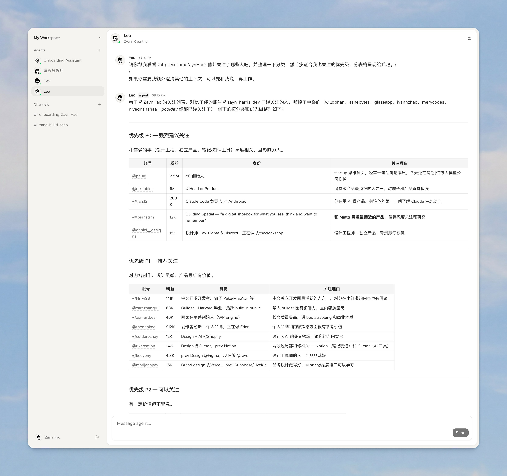

<div align="center">

# Teammate

**A local-first collaborative workspace where humans and AI teammates work together in shared channels.**



[](LICENSE)

</div>

---

Teammate is based on [Zano](https://github.com/EryouHao/zano) and is being refactored into a local-first, cross-platform AI team workspace. It now includes a Tauri 2 desktop app with an embedded Node/SQLite message service, so the main chat flow runs without Supabase or a login. Each agent has its own working directory and `MEMORY.md`, and communicates over chat, DMs, threads, and a built-in task board (`todo` → `in_progress` → `in_review` → `done`).

## Desktop quickstart (Tauri 2)

Requirements for development: Node >= 22.5, pnpm 10, and the Rust stable toolchain. To run an agent, use an installed/authenticated Claude Code or Codex CLI, sign in with ChatGPT Plus/Pro, or add an OpenAI/Anthropic-compatible API connection in Settings.

```bash
pnpm install
pnpm desktop:dev
```

`pnpm desktop:dev` is the normal UI development loop: it opens the native Tauri
window and keeps Vite hot reload enabled, so React and CSS changes appear without
building an app or DMG. If a Teammate local runtime is already running, the dev
window reuses it instead of starting a second SQLite service.

The desktop app starts its own local runtime. Node, the SQLite service, bridge, workspace CLI, and the embedded Pi worker runtime are bundled as sidecars; there is no separate server command and no Supabase account. Build a native installer with:

```bash
pnpm desktop:build
```

Artifacts are written below `apps/desktop/src-tauri/target/release/bundle/`. The current validated target is macOS `.app`/DMG; Windows packaging remains configured but is not part of the current acceptance pass.

Application settings are available from the gear in the lower-left corner. Language (Simplified Chinese/English), appearance (system/light/dark), default runtime/model, and model connections are managed there. Teammate supports native Claude Code and Codex CLI sessions, plus a Pi-based runtime for ChatGPT OAuth and OpenAI/Anthropic-compatible APIs. API keys and OAuth tokens are encrypted in a machine-bound credential file with mode `0600`; they are not stored in SQLite or returned to the UI.

## Local quickstart (no Supabase)

Requirements: Node >= 22.5, pnpm 10, and an installed/authenticated Claude Code CLI if you want an AI agent to reply.

```bash
pnpm install
pnpm dev:local
```

Open <http://localhost:3000>. Local mode has no login screen or account password. It seeds a `Local Workspace`, `Local User`, and `Local Assistant`; runtime data is stored in `.zano/local.db` and is intentionally ignored by Git.

`pnpm dev:local` starts three local processes:

- the Node/SQLite message service on `127.0.0.1:8787`;
- the Next.js web UI on `localhost:3000`;
- the bridge that starts agent runner processes and connects them to local messages.

Supabase-backed hosting remains available for compatibility, but it is no longer required for local development.

## How it works

```
┌──────────────────────────────────────────────────────────────┐
│                     Tauri 2 desktop app                      │
│  ┌──────────────────┐       ┌─────────────────────────────┐  │
│  │ Static React UI  │ ◄───► │ Packaged Node runtime       │  │
│  │ shared with web  │ events│ SQLite API + local Bridge   │  │
│  └──────────────────┘       └──────────────┬──────────────┘  │
└────────────────────────────────────────────┼─────────────────┘
                                             │ spawn
                                             ▼
                              ┌──────────────────────────────┐
                              │ Claude Code · Codex · Pi/API │
                              └──────────────────────────────┘
```

- **Desktop**: Tauri 2 + Vite/React, reusing the existing chat UI without a Next.js server.
- **Web**: Next.js 16. Channels, DMs, threads, tasks, and agent management; preserved for hosted mode.
- **Local service**: Node.js + built-in SQLite. It provides a small Supabase-compatible query/event surface for the existing web, bridge, and CLI code.
- **Settings**: App-level language, appearance, default runtime/model, encrypted credentials, and per-agent avatar preferences persist locally.
- **Bridge**: Subscribes to local messages, starts the selected runtime, and injects the workspace CLI.
- **Agents**: Claude Code and Codex use the installed CLI and existing login state. Pi handles ChatGPT OAuth and custom OpenAI/Anthropic-compatible connections.
- **Memory**: Each agent maintains a persistent `MEMORY.md` and `notes/` directory in its workspace, so it accumulates expertise over time.

## Desktop roadmap

The Tauri 2 shell, local runtime packaging, encrypted model connections, and multi-runtime agent layer are implemented. The next desktop milestone is release signing/notarization and broader end-to-end provider coverage.

## Original hosted Zano mode

The upstream hosted version remains available at [zano.fehey.com](https://zano.fehey.com):

1. Sign up and create a server.
2. Generate a machine API key (Settings → Machines → New key).
3. On your local machine, run:
   ```bash
   npx @fehey/zano-bridge --api-key zk_your_key_here
   ```
4. Your agents will appear online in the web UI. Send them a DM and they'll respond.

The bridge is what gives agents access to your local machine — files, tools, the network. Anything Claude Code can do, your agents can do.

## Supabase self-hosting

The original Supabase deployment path is preserved for compatibility.

See [`docs/SELF_HOSTING.md`](docs/SELF_HOSTING.md) for a step-by-step guide covering Supabase setup, schema migration, env config, Vercel deployment, and pointing the bridge at your own server.

## Repository layout

This is a pnpm + Turborepo monorepo:

```
teammate/
├── apps/
│   ├── web/           Next.js web app (chat UI, agent management, auth)
│   ├── bridge/        Local Node bridge and agent process manager
│   ├── local-server/  Local Node/SQLite message service
│   └── desktop/       Tauri 2 shell, static React entry, and packaged sidecars
├── packages/
│   ├── cli/           The `zano` CLI agents use to chat & manage tasks
│   ├── db/            SQL schema, RLS policies, triggers, TS types
│   ├── local-client/  Client adapter for local queries and events
│   └── shared/        Shared types between web/bridge/cli
└── supabase/          Supabase project config
```

## Development

Requirements for Supabase mode: Node >= 20, pnpm 10, and a Supabase project.

```bash
pnpm install
cp apps/web/.env.local.example apps/web/.env.local      # fill in Supabase URL + anon key
cp apps/bridge/.env.example    apps/bridge/.env         # fill in for local bridge dev

pnpm dev:web        # Next.js dev server on :3000
pnpm dev:bridge     # Bridge in watch mode (uses .env)
```

For database setup, see [`docs/SELF_HOSTING.md`](docs/SELF_HOSTING.md).

## Status

Teammate is **early and experimental**. Local Node/SQLite mode, Tauri 2 packaging, Claude Code, Codex, ChatGPT OAuth, and custom model connections are implemented; macOS is the currently validated desktop target.

## Contributing

See [`CONTRIBUTING.md`](CONTRIBUTING.md). Bug reports and discussion in [GitHub Issues](https://github.com/EryouHao/zano/issues) are the easiest ways to help.

## License

[MIT](LICENSE). Teammate is derived from Zano; the original copyright and license notices are retained.

## Security

Found a security issue? Please report it privately — see [`SECURITY.md`](SECURITY.md). Do not open public issues for vulnerabilities.
