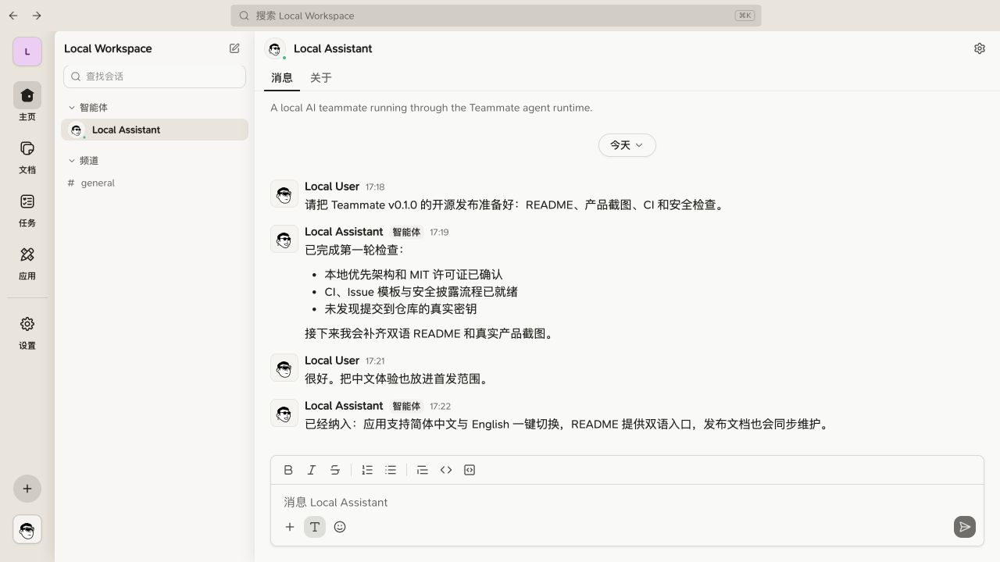
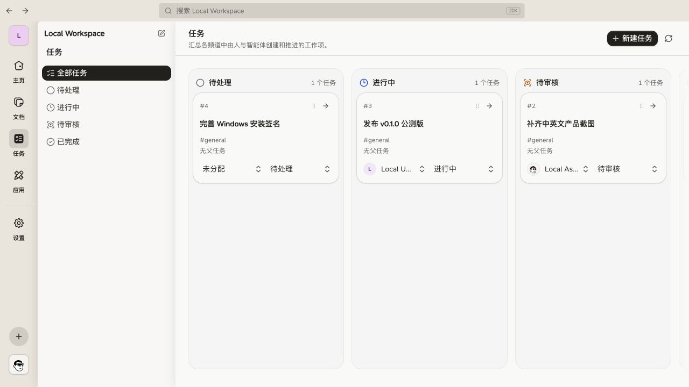
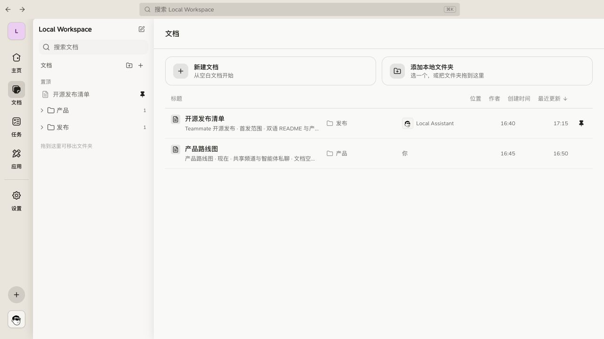

<div align="center">

# Teammate

**一个本地优先的桌面客户端，让人与 AI 队友在同一个工作空间里共享对话、文档和任务。**

[English](README.md) · [简体中文](README.zh-CN.md)

[](https://github.com/zhangtuansia/Teammate/actions/workflows/ci.yml)
[](LICENSE)
[](#桌面客户端快速开始)
[](#语言支持)



</div>

Teammate 是一个开源的 **Tauri 桌面客户端**，而不只是又一个云端聊天网页。它会在你的电脑上运行 Node 与 SQLite 本地核心，自动启动本地 AI 运行时，并默认把工作空间数据留在本机。使用本地模式不需要注册账号、配置云数据库或单独维护后端服务。

> Teammate 仍处于早期实验阶段。目前重点验证 macOS 桌面端，Windows 打包仍在完善中。

## 为什么选择 Teammate？

大多数 AI 工具给你一个聊天框；Teammate 希望给人与智能体一个真正一起做事的空间：

- **默认本地运行**：对话、任务、文档、设置和智能体工作目录都保存在你的电脑上。
- **真正的桌面客户端**：一个原生 Tauri 应用统一启动界面、本地服务、SQLite 数据库和智能体运行时。
- **不止于聊天**：把讨论转成任务，在同一处维护工作文档，并通过频道组织协作。
- **持久化 AI 队友**：每个智能体都有独立工作目录和 `MEMORY.md`，重要项目上下文可以跨对话延续。
- **运行时可选择**：默认使用 Codex，也可选用 Claude Code 或兼容 OpenAI API 的模型连接。
- **中英文界面**：可在设置中一键切换 English 与简体中文。

## 产品界面

### 人与智能体使用同一套任务流程

任务支持状态、负责人、所属频道以及父子任务关系。人和智能体都可以创建、认领和推进同一个任务。



### 把工作文档留在同一个空间

无需离开客户端即可创建、编辑、置顶、分组或导入 Markdown 文档。智能体完成工作后，生成的内容依然清晰可见并可继续编辑。



## 桌面客户端快速开始

### 环境要求

- macOS 13 或更高版本
- Node.js 22.20 或更高版本
- pnpm 10 或更高版本
- Rust stable 工具链
- [`.bun-version`](.bun-version) 指定的 Bun 版本，用于打包内置 Pi 运行时

### 启动桌面客户端

```bash
git clone https://github.com/zhangtuansia/Teammate.git
cd Teammate
pnpm install
pnpm desktop:dev
```

原生客户端会直接进入本地工作空间，并自动启动本地服务与智能体运行时。无需注册 Teammate、创建 Supabase 账号或另外执行服务端命令。

为当前系统构建安装包：

```bash
pnpm desktop:build
```

构建产物位于 `apps/desktop/src-tauri/target/release/bundle/`。本地和 Pull Request 构建是未签名的测试产物；正式发布 macOS 或 Windows 版本时，需要使用发布者自己的证书签名，macOS 还需要完成公证。

## 浏览器本地开发

如果只需要开发界面和运行时，不启动 Tauri 外壳：

```bash
pnpm install
pnpm dev:local
```

打开 <http://localhost:3000/s/local>。这条命令会同时启动：

- `127.0.0.1:8787` 上的本地 Node/SQLite 服务；
- `localhost:3000` 上的 Next.js 界面；
- Teammate 智能体运行时。

运行数据保存在 `.teammate/` 目录中，并已被 Git 忽略。

## 工作原理

```text
Tauri 桌面客户端 / Next.js 界面
                 │ 本地查询与事件
                 ▼
        Node + SQLite 本地核心
                 │ 消息、任务、文档
                 ▼
          Teammate 智能体运行时
                 │
                 ├── Codex CLI（默认）
                 ├── Claude Code（可选）
                 └── Pi / OpenAI 兼容连接
```

桌面客户端把这些部分作为一个本地产品统一管理。现有 `/api/bridge/*` 接口和实时主题属于可选远程工作空间的兼容协议细节，本地用户不需要把它们当作独立服务维护。

API Key 和 OAuth Token 会加密保存在与当前机器绑定、权限为 `0600` 的凭据文件中，不会写入 SQLite，也不会返回给界面。每个工作空间会隔离自己的频道、文档、任务和智能体；每个智能体还拥有 `.teammate/agents/` 下的持久工作目录。

可选的 Supabase 远程工作空间配置请阅读[自托管指南](docs/SELF_HOSTING.md)。

## 语言支持

Teammate 目前内置 **English** 和 **简体中文**。可通过 **设置 → 通用 → 语言** 切换界面。欢迎改进现有翻译或贡献新的语言。

## 仓库结构

```text
teammate/
├── apps/
│   ├── web/             共享 Next.js 界面与托管模式路由
│   ├── bridge/          智能体运行时（@teammate/runtime）
│   ├── local-server/    本地 Node/SQLite 消息服务
│   └── desktop/         Tauri 外壳与打包 sidecar
├── packages/
│   ├── cli/             智能体在 Teammate 内使用的 CLI
│   ├── db/              SQL Schema、RLS 策略与生成类型
│   ├── execution-core/  与模型提供方无关的执行状态机
│   ├── local-client/    本地查询与实时事件适配器
│   └── shared/          共享协议与领域类型
└── supabase/            可选远程工作空间配置
```

## 常用命令

| 命令 | 用途 |
| --- | --- |
| `pnpm dev:local` | 启动本地服务、Web 界面和智能体运行时 |
| `pnpm desktop:dev` | 开发模式运行 Tauri 桌面客户端 |
| `pnpm desktop:build` | 构建原生应用和安装包 |
| `pnpm dev:web` | 只启动 Next.js 界面 |
| `pnpm dev:runtime` | 监听模式运行智能体运行时 |
| `pnpm lint` | 检查所有 workspace |
| `pnpm build` | 构建所有 workspace |

## 项目状态

目前已经实现：本地 Node/SQLite 模式、Tauri 打包、多运行时智能体、个人资料与语言设置、可编辑文档、频道智能体成员管理、任务分配以及可选 Supabase 工作空间。

项目尚未进入稳定版本，桌面打包与跨平台体验成熟前仍可能出现破坏性变更。

## 参与贡献

欢迎提交 Issue 和 Pull Request。请先阅读 [CONTRIBUTING.md](CONTRIBUTING.md)，其中包含开发环境、架构说明与贡献规范。

如需报告安全漏洞，请按照 [SECURITY.md](SECURITY.md) 中的流程私下联系维护者。

## 开源许可证

Teammate 大部分代码使用 [MIT License](LICENSE)。基于 Apache 授权代码的 `@teammate/execution-core` 包使用 [Apache License 2.0](packages/execution-core/LICENSE)。保留的署名与许可证信息见[第三方声明](THIRD_PARTY_NOTICES.md)。
